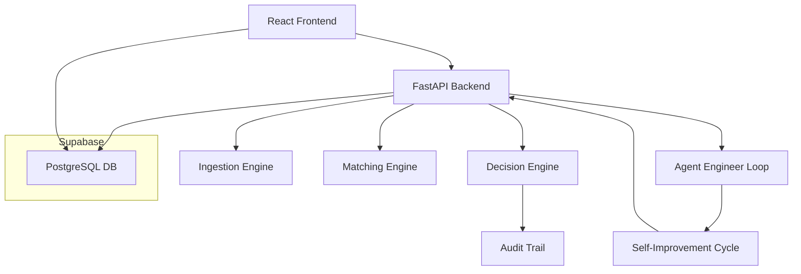
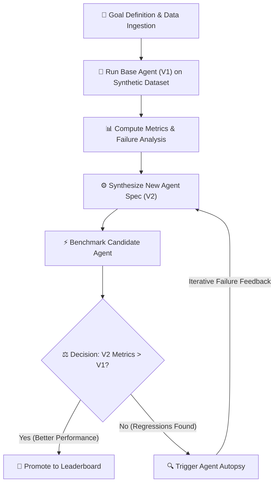

<div align="center">

# ⚙️ LedgerForge

### Autonomous AI Bank Reconciliation Platform

*An agentic AI system that knows when to act — and when to ask.*


[](https://fastapi.tiangolo.com/)
[](https://reactjs.org/)
[](https://supabase.com/)
[](https://openai.com/)
[](https://python.org/)
[](LICENSE)

</div>

---

## 🏗️ Architecture Diagram



## 🤖 Agent Architecture & Self‑Improvement Loop



The **Agent Engineer Loop** continuously refines the reconciliation agent. It starts by deploying a baseline version (V1) on a synthetic dataset to establish a performance baseline. Metrics are collected, and failure cases are analyzed to isolate weaknesses. A new specification (V2) is synthesized and benchmarked against V1. If the candidate surpasses the baseline across accuracy, precision, and risk metrics, it is promoted to production; otherwise, an automated autopsy provides targeted feedback back into the synthesis engine.

---

## 📖 Overview

**LedgerForge** (codename: *LedgerMind*) is a production-grade **autonomous agentic AI system** for bank reconciliation. It replaces time-consuming, error-prone manual reconciliation workflows with a self-improving multi-agent pipeline that matches bank transactions against ledger entries, escalates ambiguous cases to humans, and continuously evolves its own matching strategy.

> **Core Principle:** *"Knows when to stop and ask."*
> The system never auto-reconciles transactions it isn't confident about. High model confidence **never** overrides a hard financial discrepancy.

---
## ✨ Key Features

| Feature | Description |
|---|---|
| 🤖 **Autonomous Agent Loop** | Self-improving V1 → V2 → V3 agent engineering cycle |
| 🔍 **Multi-Tier Matching** | Rule-based → Fuzzy → LLM escalation pipeline |
| 🛡️ **Decision Engine** | Configurable policy enforcement with zero-tolerance for high-risk mismatches |
| 👤 **Human-in-the-Loop** | Smart exception queue with escalation reasoning |
| 📊 **Agent Leaderboard** | Real-time benchmarking and performance comparison across agent versions |
| 🔬 **Agent Autopsy** | Automated failure analysis and root-cause diagnosis |
| 📋 **Full Audit Trail** | Every decision is logged with evidence, confidence scores, and timestamps |
| 🔄 **Live Eval Framework** | Synthetic dataset generation for continuous benchmarking |

---

## 🏗️ Architecture

```
┌─────────────────────────────────────────────────────────────────┐
│                        LedgerForge Platform                     │
├─────────────────┬───────────────────────────────────────────────┤
│   React Frontend│              FastAPI Backend                   │
│   (Vite + JSX)  │                                               │
│                 │  ┌──────────┐  ┌──────────┐  ┌────────────┐  │
│  • Dashboard    │  │Ingestion │→ │Matching  │→ │ Decision   │  │
│  • Upload CSV   │  │ Engine   │  │ Engine   │  │  Engine    │  │
│  • Exception    │  └──────────┘  └──────────┘  └────────────┘  │
│    Queue        │        ↓              ↓              ↓        │
│  • Agent        │  ┌──────────────────────────────────────┐     │
│    Leaderboard  │  │     Agent Engineering Loop            │     │
│  • Audit Trail  │  │  Run → Eval → Analyze → Improve      │     │
│  • Landing Page │  └──────────────────────────────────────┘     │
├─────────────────┴───────────────────────────────────────────────┤
│                    Supabase (PostgreSQL + RLS)                   │
└─────────────────────────────────────────────────────────────────┘
```

---

## 🧠 Agent Pipeline

LedgerForge implements a **9-phase autonomous reconciliation pipeline**:

```
Phase 1: Data Ingestion & Normalization
    ↓  CSV/API → normalized transactions with currency conversion
Phase 2: Multi-Tier Matching Engine
    ↓  Rule-based (exact) → Fuzzy (TF-IDF/amount proximity) → LLM fallback
Phase 3: Reconciliation Agent (LLM)
    ↓  GPT-4o-mini evaluates ambiguous candidate matches with evidence
Phase 4: Decision & Escalation Engine
    ↓  Policy checks: confidence threshold, evidence count, exception type,
       material amount variance override, ambiguity index
Phase 5: Audit Trail
    ↓  Full immutable log: every decision, policy check, evidence chain
Phase 6: Agent Engineer (Self-Improvement Loop)
    ↓  Benchmarks current agent → diagnoses failures → proposes new agent spec
Phase 7: Agent Autopsy
    ↓  Deep failure root-cause analysis per transaction type
Phase 8: Evaluation Framework
    ↓  Synthetic dataset generation + metrics: accuracy, STP rate, false auto-post rate
Phase 9: Full Integration Pipeline
    ↓  End-to-end orchestration with leaderboard promotion logic
```

---

## 🗂️ Project Structure

```
ledgerMind/
├── backend/                         # FastAPI Python backend
│   ├── app/
│   │   ├── api/
│   │   │   ├── endpoints/
│   │   │   │   ├── ingest.py        # CSV upload & normalization
│   │   │   │   ├── reconcile.py     # Reconciliation pipeline API
│   │   │   │   ├── exceptions.py    # Human-in-the-loop queue
│   │   │   │   ├── agents.py        # Agent version management
│   │   │   │   ├── evals.py         # Evaluation & leaderboard
│   │   │   │   ├── audit.py         # Audit trail endpoints
│   │   │   │   ├── agent_engineer.py# Autonomous engineer API
│   │   │   │   ├── autopsy_endpoints.py # Failure analysis API
│   │   │   │   └── pipeline.py      # Full pipeline endpoint
│   │   │   └── router.py
│   │   ├── core/
│   │   │   ├── database.py          # SQLAlchemy + SQLite config
│   │   │   └── currency.py          # Multi-currency normalization
│   │   ├── models/
│   │   │   ├── db.py                # SQLAlchemy ORM models
│   │   │   ├── pydantic_models.py   # Request/response schemas
│   │   │   └── dataset_models.py    # Eval dataset types
│   │   ├── services/
│   │   │   ├── matching_engine.py   # Multi-tier matching logic
│   │   │   ├── decision_engine.py   # Policy enforcement & escalation
│   │   │   ├── llm_agent.py         # OpenAI / LiteLLM integration
│   │   │   ├── agent_engineer.py    # Self-improvement loop
│   │   │   ├── agent_registry.py    # Agent version registry
│   │   │   ├── autopsy_engine.py    # Failure root-cause analysis
│   │   │   ├── eval_engine.py       # Benchmarking engine
│   │   │   ├── eval_framework.py    # Eval metrics computation
│   │   │   ├── failure_analyzer.py  # Failure pattern detection
│   │   │   ├── ingestion.py         # CSV parsing & normalization
│   │   │   ├── audit_service.py     # Audit log persistence
│   │   │   ├── pipeline_service.py  # End-to-end orchestration
│   │   │   ├── report_service.py    # Report generation
│   │   │   └── supabase_service.py  # Supabase sync
│   │   └── main.py                  # FastAPI app entry point
│   ├── tests/                       # Pytest test suite
│   ├── requirements.txt
│   └── .env.example
│
├── frontend/                        # React + Vite frontend
│   ├── src/
│   │   ├── components/
│   │   │   ├── LandingPage.jsx      # Marketing landing page
│   │   │   ├── DashboardStats.jsx   # KPI overview
│   │   │   ├── DualUploadCard.jsx   # Bank + ledger CSV upload
│   │   │   ├── TransactionTable.jsx # Reconciliation results table
│   │   │   ├── ExceptionDrawer.jsx  # Human-in-the-loop UI
│   │   │   ├── AuditDrawer.jsx      # Audit trail viewer
│   │   │   ├── AgentLeaderboard.jsx # Agent version rankings
│   │   │   ├── AgentEvolution.jsx   # V1 to V2 to V3 evolution view
│   │   │   └── landing/             # Landing page sub-components
│   │   ├── services/api.js          # Backend API client
│   │   ├── App.jsx
│   │   └── index.css
│   ├── public/assets/               # Static images & fonts
│   ├── .env.example
│   └── package.json
│
├── supabase/
│   ├── migrations/
│   │   └── 20260905000000_initial_schema.sql  # Full DB schema
│   └── seed.sql                     # Sample seed data
│
└── .gitignore
```

---

## 🚀 Getting Started

### Prerequisites

- Python **3.10+**
- Node.js **18+**
- An [OpenAI API key](https://platform.openai.com/api-keys)
- A [Supabase](https://supabase.com/) project (or use the included SQLite for local dev)

---

### 1. Clone the Repository

```bash
git clone https://github.com/MDMOINAKHTARR/LedgerForge.git
cd LedgerForge
```

---

### 2. Backend Setup

```bash
cd backend

# Create and activate virtual environment
python -m venv .venv
# Windows
.venv\Scripts\activate
# macOS/Linux
source .venv/bin/activate

# Install dependencies
pip install -r requirements.txt

# Configure environment variables
cp .env.example .env
```

Edit `backend/.env`:

```env
DATABASE_URL=sqlite:///./ledgermind.db
OPENAI_API_KEY=sk-your-openai-key-here
LLM_MODEL=gpt-4o-mini
PORT=8000

# Optional: Supabase (for cloud persistence)
SUPABASE_URL=https://your-project.supabase.co
SUPABASE_ANON_KEY=your-anon-key
SUPABASE_SERVICE_ROLE_KEY=your-service-role-key
```

Start the backend:

```bash
# From project root
python -m backend.app.main

# Or with uvicorn directly
uvicorn backend.app.main:app --host 0.0.0.0 --port 8000 --reload
```

API docs available at: **http://localhost:8000/docs**

---

### 3. Frontend Setup

```bash
cd frontend

# Install dependencies
npm install

# Configure environment variables
cp .env.example .env
```

Edit `frontend/.env`:

```env
VITE_SUPABASE_URL=https://your-project.supabase.co
VITE_SUPABASE_ANON_KEY=your-anon-key
```

Start the frontend:

```bash
npm run dev
```

App available at: **http://localhost:5173**

---

### 4. Database Setup (Supabase)

Run the migration in your Supabase SQL editor:

```bash
# Apply the schema
supabase/migrations/20260905000000_initial_schema.sql

# Seed with sample data (optional)
supabase/seed.sql
```

---

## 🔌 API Reference

Base URL: `http://localhost:8000/api/v1`

| Method | Endpoint | Description |
|---|---|---|
| `POST` | `/ingest/bank` | Upload bank statement CSV |
| `POST` | `/ingest/ledger` | Upload ledger CSV |
| `POST` | `/reconcile/run` | Run reconciliation pipeline |
| `GET` | `/exceptions/queue` | Get human escalation queue |
| `POST` | `/exceptions/{id}/resolve` | Resolve exception with human decision |
| `GET` | `/agents/versions` | List all agent versions |
| `GET` | `/evals/leaderboard` | Agent performance leaderboard |
| `POST` | `/agent-engineer/run` | Trigger agent self-improvement loop |
| `GET` | `/audit/trail` | Fetch full audit trail |
| `POST` | `/pipeline/run` | Run full end-to-end pipeline |

> 📚 Full interactive API docs: `http://localhost:8000/docs`

---

## ⚙️ Decision Engine — How It Works

The `DecisionEngine` evaluates every reconciliation proposal against a configurable **DecisionPolicy** with 4 checks:

```
✅ Check 1: Minimum Evidence Count
    → At least N evidence points must support the match

✅ Check 2: Confidence Threshold
    → Agent confidence must exceed policy threshold (default: 90%)

✅ Check 3: Allowed Exception Category
    → Only pre-approved exception types can auto-reconcile

🛡️ Check 4: Hard High-Risk Safety Overrides (CANNOT be bypassed)
    → 4A: Material amount variance > $0.05 → ESCALATE
    → 4B: Duplicate transaction detected → ESCALATE
    → 4C: Top 2 candidates within 5% confidence (ambiguity) → ESCALATE
    → 4D: Partial payment / overpayment / missing invoice → ESCALATE
```

**Final Decisions:**
- ✅ **AUTO_RECONCILE** — All 4 checks pass
- ⚠️ **ESCALATE_TO_HUMAN** — Any check fails, with detailed explanation
- ❌ **REJECT** — No credible ledger candidate found

---

## 🤖 Agent Self-Improvement Loop

```
Goal Definition
    ↓
Run Base Agent (V1) on Synthetic Dataset (60 transactions)
    ↓
Compute Metrics: Accuracy · STP Rate · False Auto-Post Rate · Latency
    ↓
Failure Analysis: Root-cause per exception type
    ↓
Synthesize New Agent Spec (V2): Updated thresholds, matching rules, prompts
    ↓
Benchmark Candidate Agent on Same Dataset
    ↓
Compare: If V2 > V1 on key metrics → Promote to Leaderboard
    ↓
Repeat → V3, V4, ...
```

---

## 🧪 Running Tests

```bash
# From project root (with venv activated)
pytest backend/tests/ -v

# Run specific test files
pytest backend/tests/test_reconciliation_pipeline.py -v
pytest backend/tests/test_reconciliation_accuracy_audit.py -v
```

---

## 🗄️ Database Schema

The Supabase schema includes tables for:

| Table | Purpose |
|---|---|
| `agent_versions` | Agent version registry with parent/child evolution |
| `reconciliations` | Reconciliation run metadata and aggregate metrics |
| `bank_transactions` | Normalized bank statement records |
| `ledger_transactions` | Normalized ledger/ERP records |
| `matches` | Transaction match results with confidence scores |
| `decisions` | Final decision log with policy check results |
| `audit_logs` | Immutable audit trail for every agent action |
| `failure_analyses` | Agent autopsy reports per optimization run |

All tables use **Row Level Security (RLS)** via Supabase.

---

## 🛠️ Tech Stack

### Backend
| Technology | Version | Purpose |
|---|---|---|
| **FastAPI** | 0.110+ | REST API framework |
| **SQLAlchemy** | 2.0+ | ORM (SQLite for local, Supabase for cloud) |
| **Pydantic** | 2.6+ | Data validation & serialization |
| **LiteLLM** | 1.30+ | LLM provider abstraction |
| **OpenAI** | 1.14+ | GPT-4o-mini for match reasoning |
| **Pandas** | 2.2+ | CSV parsing & data normalization |
| **Supabase Python** | 2.3+ | Cloud database sync |
| **Uvicorn** | 0.28+ | ASGI server |

### Frontend
| Technology | Version | Purpose |
|---|---|---|
| **React** | 18.2 | UI framework |
| **Vite** | 5.1 | Build tool & dev server |
| **Tailwind CSS** | 3.4 | Utility-first styling |
| **Supabase JS** | 2.115+ | Real-time data & auth |
| **Lucide React** | 0.344 | Icon system |

### Infrastructure
| Technology | Purpose |
|---|---|
| **Supabase** | PostgreSQL database with RLS |
| **SQLite** | Local development database |

---

## 📁 Sample Data

The project includes synthetic sample data for testing:

- `backend/app/data/synthetic_bank_transactions.csv` — 100 synthetic bank transactions
- `backend/app/data/synthetic_company_ledger.csv` — Corresponding ledger entries
- `supabase/seed.sql` — Database seed with realistic sample records

---

## 🔐 Environment Variables

### Backend (`backend/.env`)

| Variable | Required | Description |
|---|---|---|
| `DATABASE_URL` | ✅ | SQLAlchemy connection string |
| `OPENAI_API_KEY` | ✅ | OpenAI API key for LLM agent |
| `LLM_MODEL` | ✅ | Model name (e.g. `gpt-4o-mini`) |
| `PORT` | ✅ | Server port (default: 8000) |
| `SUPABASE_URL` | Optional | Supabase project URL |
| `SUPABASE_ANON_KEY` | Optional | Supabase anonymous key |
| `SUPABASE_SERVICE_ROLE_KEY` | Optional | Supabase service role key |

### Frontend (`frontend/.env`)

| Variable | Required | Description |
|---|---|---|
| `VITE_SUPABASE_URL` | ✅ | Supabase project URL |
| `VITE_SUPABASE_ANON_KEY` | ✅ | Supabase anonymous key |

> Never commit `.env` files. Use `.env.example` as the template.

---

## 🤝 Contributing

1. Fork the repository
2. Create a feature branch: `git checkout -b feature/your-feature-name`
3. Commit your changes: `git commit -m 'feat: add amazing feature'`
4. Push to the branch: `git push origin feature/your-feature-name`
5. Open a Pull Request

Please follow [Conventional Commits](https://www.conventionalcommits.org/) for commit messages.

---

## 📄 License

This project is licensed under the **MIT License** — see the [LICENSE](LICENSE) file for details.

---

<div align="center">

Built with love by [MDMOINAKHTARR](https://github.com/MDMOINAKHTARR)

*"The agent that knows when to stop and ask."*

</div>
