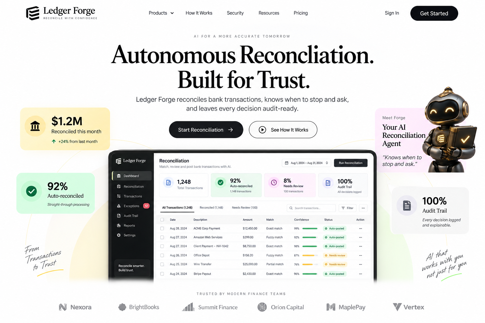
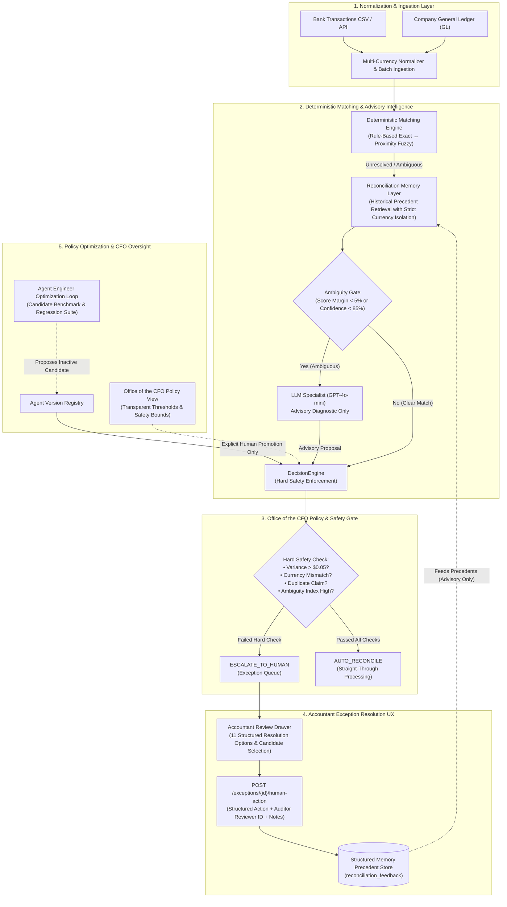
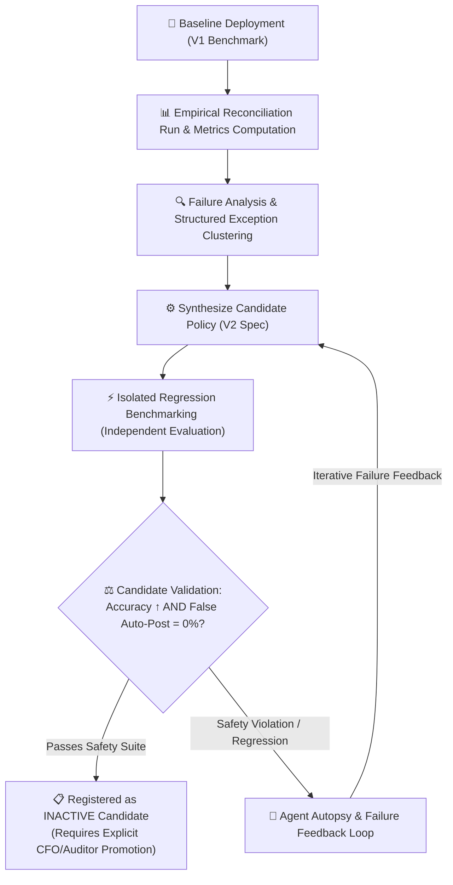

<div align="center">

# ⚙️ LedgerForge

### Autonomous AI Bank Reconciliation Platform
*Enterprise-grade autonomous reconciliation that knows when to act — and when to ask.*



[](https://fastapi.tiangolo.com/)
[](https://reactjs.org/)
[](https://supabase.com/)
[](https://openai.com/)
[](https://python.org/)
[](LICENSE)

</div>

---

## 🏗️ Architecture & Control Flow

LedgerForge operates under a **strictly governed hierarchical control flow**. The LLM never acts as an unconstrained authority — it functions exclusively as an advisory reasoning specialist for ambiguous edge cases, governed by deterministic safety rules and hard financial guardrails.



---

## 🤖 Controlled Agent Engineering & Self-Improvement Loop



> **Zero Autonomous Mutation in Production:** The optimization system can **never** self-activate or mutate runtime matching policies. All candidate improvements are registered in an inactive state and require manual human promotion, protecting production ledgers from silent drift.

---

## 📖 Overview

**LedgerForge** (codename: *LedgerMind*) is an enterprise-grade **autonomous agentic AI platform** for bank-to-general-ledger reconciliation. Built specifically for accounting teams, controllers, and the Office of the CFO, LedgerForge replaces error-prone manual spreadsheets with an auditable, self-improving pipeline that reconciles high-volume transactions, escalates ambiguous edge cases to humans, and preserves strict internal accounting controls.

> **Core Axiom:** *"Knows when to act — and when to ask."*  
> High model confidence **never** overrides hard financial discrepancies. Zero tolerance for cross-currency contamination, material variances, or duplicate allocations.

---

## ✨ Key Capabilities

| Capability | Description |
|---|---|
| 🛡️ **Office of the CFO Governance** | Transparent read-only dashboard detailing active decision thresholds, straight-through processing rules, and non-negotiable hard safety boundaries. |
| 👤 **Accountant Exception Review UX** | Rich, audit-ready drawer with **11 structured accounting resolutions** (e.g. *Bank Fee, Timing Difference, Partial Payment, Candidate Re-assignment*), preventing generic uninformative overrides. |
| 🧠 **Structured Precedent Memory** | Advisory historical case retrieval matching on currency, exception type, and amount proximity. Features strict currency boundary isolation and conflict detection. |
| 🔍 **Multi-Tier Matching Engine** | Deterministic exact rule-matching → normalized multi-field fuzzy scoring (reference, description, date proximity) → gated LLM specialist reasoning. |
| 🤖 **Gated LLM Specialist** | GPT-4o-mini acts strictly as an advisory analyst for ambiguous candidate sets, generating human-readable evidence chains without decision authority. |
| ⚡ **Hard Safety Rule Engine** | Enforces zero-tolerance checks: material variance ($0.05), currency parity, duplicate claim detection, and candidate score ambiguity lockouts. |
| 📊 **Autonomous Policy Optimization** | Controlled background benchmarking that evaluates policy candidates against historical regressions and registers them for explicit human promotion. |
| 📋 **Immutable Audit Trail** | Every automated decision and human override is logged with evidence, confidence scores, reviewer IDs, timestamps, and justification notes. |

---

## 🏗️ System Architecture

```
┌─────────────────────────────────────────────────────────────────────────┐
│                           LedgerForge Platform                          │
├──────────────────────┬──────────────────────────────────────────────────┤
│   React Frontend     │                 FastAPI Backend                  │
│   (Vite + JSX)       │                                                  │
│                      │  ┌────────────┐   ┌────────────┐  ┌───────────┐  │
│  • CFO Policy View   │  │ Ingestion  │ → │  Matching  │→ │ Decision  │  │
│  • Exception Queue   │  │  Engine    │   │   Engine   │  │  Engine   │  │
│  • Audit Trail       │  └────────────┘   └──────┬─────┘  └─────▲─────┘  │
│  • Candidate Re-pick │         │                │              │        │
│  • Agent Leaderboard │         ▼                ▼              │        │
│  • Upload CSV        │  ┌─────────────────────────────┐        │        │
│  • Landing Page      │  │ Historical Memory Layer     │        │        │
│                      │  │ (Advisory Precedent Store)  │────────┤        │
│                      │  └──────────────┬──────────────┘        │        │
│                      │                 ▼                       │        │
│                      │  ┌─────────────────────────────┐        │        │
│                      │  │ Gated LLM Reasoning Agent   │────────┘        │
│                      │  │ (Ambiguity Specialist)      │ (Advisory Only) │
│                      │  └─────────────────────────────┘                 │
├──────────────────────┴──────────────────────────────────────────────────┤
│                       Supabase (PostgreSQL + RLS)                       │
│    • reconciliations   • matches   • decisions   • reconciliation_feedback │
└─────────────────────────────────────────────────────────────────────────┘
```

---

## 🗂️ Project Structure

```
ledgerMind/
├── backend/                             # FastAPI Python backend
│   ├── app/
│   │   ├── api/
│   │   │   ├── endpoints/
│   │   │   │   ├── ingest.py            # Bank & ledger CSV normalization
│   │   │   │   ├── reconcile.py         # Multi-tier reconciliation API
│   │   │   │   ├── exceptions.py        # Exception queue & human-action API
│   │   │   │   ├── agents.py            # Active policy & version management
│   │   │   │   ├── evals.py             # Benchmarks & leaderboard
│   │   │   │   ├── audit.py             # Immutable audit trail
│   │   │   │   ├── agent_engineer.py    # Policy optimization loop
│   │   │   │   ├── autopsy_endpoints.py # Failure root-cause diagnostics
│   │   │   │   └── pipeline.py          # End-to-end batch execution
│   │   │   └── router.py
│   │   ├── core/
│   │   │   ├── database.py              # SQLAlchemy engine & session config
│   │   │   └── currency.py              # Multi-currency normalization & safety
│   │   ├── models/
│   │   │   ├── db.py                    # SQLAlchemy ORM models (+ feedback)
│   │   │   ├── pydantic_models.py       # Pydantic validation schemas
│   │   │   └── dataset_models.py        # Evaluation & benchmark types
│   │   ├── services/
│   │   │   ├── matching_engine.py       # Deterministic rule & fuzzy engine
│   │   │   ├── decision_engine.py       # Policy enforcement & hard safety rules
│   │   │   ├── memory_service.py        # Precedent memory with currency isolation
│   │   │   ├── llm_agent.py             # Controlled advisory LLM specialist
│   │   │   ├── agent_engineer.py        # Controlled policy optimization
│   │   │   ├── agent_registry.py        # Policy registry & promotion control
│   │   │   ├── meta_agent_loop.py       # Optimization orchestrator
│   │   │   ├── autopsy_engine.py        # Failure pattern diagnosis
│   │   │   ├── eval_engine.py           # Benchmark execution engine
│   │   │   ├── eval_framework.py        # Metric calculation (STP, accuracy)
│   │   │   ├── ingestion.py             # CSV parsing & normalization
│   │   │   ├── audit_service.py         # Comprehensive audit persistence
│   │   │   └── pipeline_service.py      # Full pipeline orchestrator
│   │   └── main.py                      # Application entry point
│   ├── tests/                           # Comprehensive Pytest suite (112 tests)
│   ├── requirements.txt
│   └── .env.example
│
├── frontend/                            # React + Vite frontend
│   ├── src/
│   │   ├── components/
│   │   │   ├── ReconciliationPolicyView.jsx # CFO Policy & Safety Governance View
│   │   │   ├── AuditDrawer.jsx          # Month-End Exception Review UX
│   │   │   ├── DashboardStats.jsx       # Financial KPI summary cards
│   │   │   ├── DualUploadCard.jsx       # Multi-currency CSV file uploader
│   │   │   ├── TransactionTable.jsx     # Reconciliation ledger table
│   │   │   ├── AgentLeaderboard.jsx     # Policy benchmark rankings
│   │   │   ├── AgentEvolution.jsx       # Policy iteration visualizer
│   │   │   └── LandingPage.jsx          # Public landing interface
│   │   ├── services/api.js              # Centralized backend API client
│   │   ├── App.jsx                      # Navigation & shell orchestration
│   │   └── index.css                    # Tailwind CSS styling
│   ├── public/assets/                   # Visual assets
│   ├── package.json
│   └── vite.config.js
│
├── supabase/
│   ├── migrations/
│   │   ├── 20260905000000_initial_schema.sql         # Base database schema
│   │   └── 20260906000000_reconciliation_feedback.sql # Structured feedback table
│   └── seed.sql                         # Test seeds
│
└── README.md
```

---

## 🚀 Getting Started

### Prerequisites

- **Python 3.10+**
- **Node.js 18+** & npm
- An [OpenAI API Key](https://platform.openai.com/api-keys) (for ambiguous case specialist reasoning)
- A [Supabase](https://supabase.com/) project (or local SQLite for instant out-of-the-box dev)

---

### 1. Clone the Repository

```bash
git clone https://github.com/MDMOINAKHTARR/LedgerForge.git
cd LedgerForge
```

---

### 2. Backend Setup

```bash
cd backend

# Create and activate virtual environment
python -m venv .venv

# Windows
.venv\Scripts\activate
# macOS/Linux
source .venv/bin/activate

# Install dependencies
pip install -r requirements.txt

# Configure environment
cp .env.example .env
```

Edit `backend/.env`:

```env
DATABASE_URL=sqlite:///./ledgermind.db
OPENAI_API_KEY=sk-your-openai-key-here
LLM_MODEL=gpt-4o-mini
PORT=8000

# Optional: Supabase for cloud database sync
SUPABASE_URL=https://your-project.supabase.co
SUPABASE_ANON_KEY=your-anon-key
SUPABASE_SERVICE_ROLE_KEY=your-service-role-key
```

Run the backend:

```bash
# Direct uvicorn execution
uvicorn backend.app.main:app --host 127.0.0.1 --port 8000 --reload
```

Interactive API documentation will be available at: **http://127.0.0.1:8000/docs**

---

### 3. Frontend Setup

```bash
cd frontend

# Install dependencies
npm install

# Configure environment
cp .env.example .env
```

Start the Vite development server:

```bash
npm run dev
```

The application interface will be live at: **http://localhost:5173**

---

### 4. Database Setup (Supabase)

If utilizing Supabase as your primary PostgreSQL store, execute the migrations in order:

```sql
-- 1. Base LedgerForge schema
supabase/migrations/20260905000000_initial_schema.sql

-- 2. Structured human feedback layer
supabase/migrations/20260906000000_reconciliation_feedback.sql
```

---

## 🔌 API Reference

Base URL: `http://localhost:8000/api/v1`

### Reconciliation & Ingestion
| Method | Endpoint | Description |
|---|---|---|
| `POST` | `/ingest/bank` | Upload and normalize bank statement CSV |
| `POST` | `/ingest/ledger` | Upload and normalize general ledger CSV |
| `POST` | `/reconcile/run` | Execute multi-tier matching & decision pipeline |
| `POST` | `/pipeline/run` | Orchestrate end-to-end ingestion and reconciliation |

### Exceptions & Structured Human Feedback
| Method | Endpoint | Description |
|---|---|---|
| `GET` | `/exceptions/queue` | Fetch all pending items requiring human escalation |
| `GET` | `/exceptions/{id}/candidates` | Retrieve available batch ledger entries for candidate re-assignment |
| `GET` | `/exceptions/{id}/memory` | Retrieve advisory historical precedent cases for this exception |
| `POST` | `/exceptions/{id}/human-action` | Record structured resolution (`BANK_FEE`, `TIMING_DIFFERENCE`, etc.) with reviewer ID and notes |
| `GET` | `/exceptions/{id}/feedback` | Fetch audit feedback records for a specific exception |
| `GET` | `/exceptions/feedback/list` | List recent structured human resolution feedback records |

### Office of the CFO Policy & Agent Governance
| Method | Endpoint | Description |
|---|---|---|
| `GET` | `/agents/active-policy` | Read-only transparency of active thresholds and immutable safety boundaries |
| `GET` | `/agents/versions` | List all historical and candidate agent policy versions |
| `POST` | `/agents/versions/{id}/promote` | Explicit human promotion of an inactive candidate to active production |
| `GET` | `/evals/leaderboard` | View benchmark performance rankings across policy versions |
| `POST` | `/agent-engineer/run` | Trigger isolated candidate policy generation and regression evaluation |
| `GET` | `/audit/trail` | Query complete, immutable audit trail with filters |

---

## 🛡️ Decision Engine & CFO Safety Boundaries

The `DecisionEngine` evaluates every match proposal against strict accounting criteria. High model confidence **cannot** bypass these non-negotiable safety guardrails:

```
┌────────────────────────────────────────────────────────────────────────┐
│                     DECISION POLICY CRITERIA CHECKS                    │
├────────────────────────────────────────────────────────────────────────┤
│ Check 1: Minimum Evidence Requirement                                  │
│   → Minimum of 2 independent matching signals (e.g. amount + ref)      │
│                                                                        │
│ Check 2: Confidence Threshold Check                                    │
│   → Matching score must strictly meet or exceed threshold (e.g. 90%)   │
│                                                                        │
│ Check 3: Straight-Through Processing Category Allowance               │
│   → Transaction type must be on the controller-approved STP whitelist │
├────────────────────────────────────────────────────────────────────────┤
│             NON-NEGOTIABLE HARD FINANCIAL SAFETY LOCKOUTS              │
├────────────────────────────────────────────────────────────────────────┤
│ 🛡️ 4A: Currency Mismatch Lockout                                      │
│   → Immediate escalation if bank currency != ledger currency           │
│                                                                        │
│ 🛡️ 4B: Material Variance Override                                      │
│   → Absolute variance > $0.05 can NEVER auto-reconcile                 │
│                                                                        │
│ 🛡️ 4C: Candidate Ambiguity Lockout                                    │
│   → If top two candidates are within 5% score margin → ESCALATE        │
│                                                                        │
│ 🛡️ 4D: Duplicate Transaction Lockout                                  │
│   → Multiple identical records in same batch trigger duplicate flag   │
│                                                                        │
│ 🛡️ 4E: High-Risk Exception Lockout                                    │
│   → Partial payments, missing invoices, or unallocated funds escalate │
└────────────────────────────────────────────────────────────────────────┘
```

---

## 🗄️ Database Schema

| Table | Purpose | Key Attributes |
|---|---|---|
| `bank_transactions` | Ingested bank records | `id`, `amount`, `currency`, `booking_date`, `description`, `reference_number` |
| `ledger_transactions` | Ingested ERP ledger entries | `id`, `amount`, `currency`, `posting_date`, `account_code`, `reference_number` |
| `reconciliations` | Batch run metadata | `id`, `agent_version_id`, `status`, `stp_rate`, `accuracy_score`, `created_at` |
| `matches` | Candidate match evaluations | `id`, `bank_id`, `ledger_id`, `confidence_score`, `tier`, `evidence` |
| `decisions` | Final decision & policy log | `id`, `match_id`, `decision`, `reason`, `policy_checks`, `risk_score` |
| `reconciliation_feedback` | Structured human actions & memory | `id`, `reconciliation_result_id`, `action`, `reviewer_id`, `currency`, `notes` |
| `agent_versions` | Policy version registry | `id`, `version_str`, `policy_config`, `is_active`, `benchmark_score` |
| `audit_logs` | Immutable compliance trail | `id`, `event_type`, `actor`, `payload`, `timestamp` |

---

## 🧪 Verification & Testing

LedgerForge maintains an extensive test suite covering multi-tier matching, advisory precedent memory, safety boundary lockouts, candidate promotion, and exception UX backend validations:

```bash
# Run the complete test suite (112 tests)
pytest backend/tests/ -v

# Run safety & policy boundary tests
pytest backend/tests/test_cfo_policy_endpoint.py -v
pytest backend/tests/test_policy_optimization_validation.py -v
pytest backend/tests/test_exception_review_ux.py -v

# Run memory & LLM specialist tests
pytest backend/tests/test_reconciliation_memory.py -v
pytest backend/tests/test_llm_reasoning_agent.py -v
```

---

## 📄 License

This project is licensed under the **MIT License** — see the [LICENSE](LICENSE) file for details.

---

<div align="center">

Built with precision for the modern accounting and finance stack.  
**LedgerForge** — *The agent that knows when to stop and ask.*

</div>
